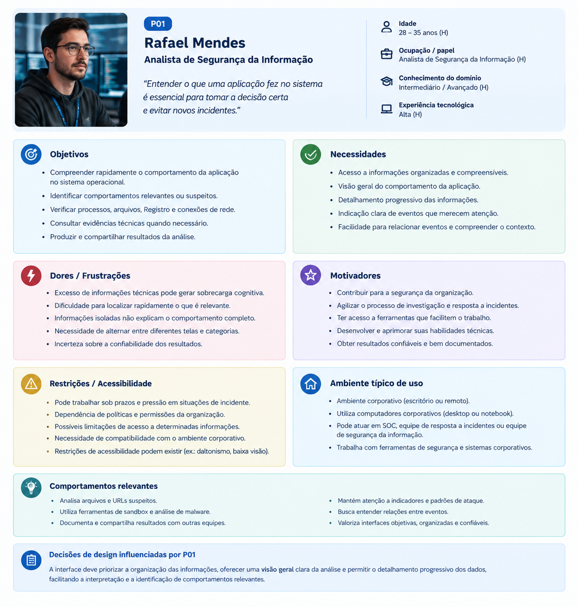
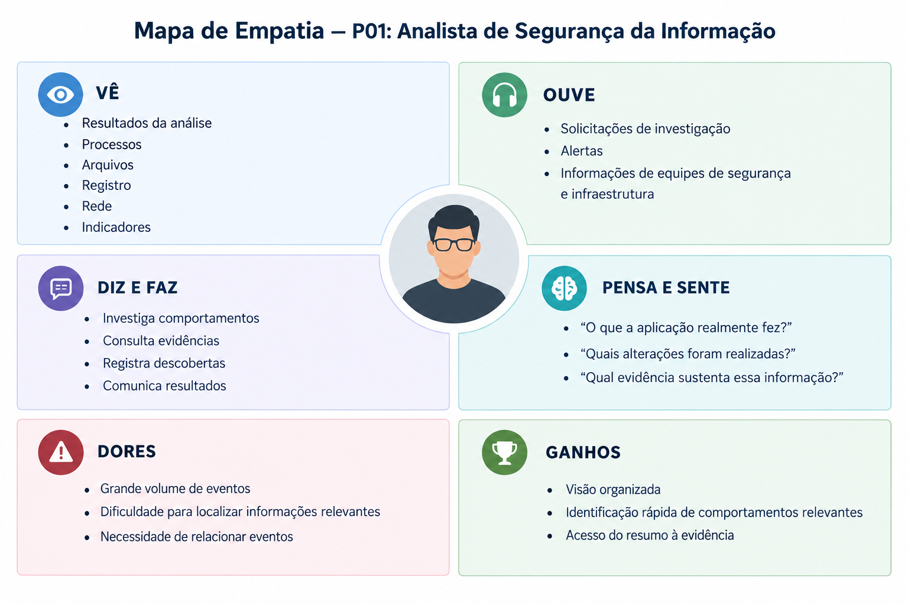

# Entrega 3 — Personas, mapa de empatia, contexto de uso e jornada

**Data:** 10/09/2026  
**Status:** 🟩 concluída  
**Responsabilidade:** 1 persona por integrante; 1 mapa de empatia, 1 contexto de uso consolidado e 1 jornada por equipe.

## Objetivo da atividade

Representar grupos de usuários de forma útil para decisões de design. Persona não é personagem decorativo: suas características devem alterar requisitos, prioridades, linguagem, fluxos ou critérios de avaliação.

## Atenção a projetos técnicos

Em TCC sem interface original, a persona representa um profissional que se apropria da contribuição técnica. Neste projeto, a persona representa um profissional de Segurança da Informação que utiliza os resultados produzidos pelo ambiente sandbox para compreender o comportamento de aplicações potencialmente não confiáveis durante sua execução controlada.

## Entradas da Entrega 1

| Item da Entrega 1 | Status inicial | Evidência disponível agora | Como será tratado nesta entrega |
|---|---|---|---|
| Usuário profissional de Segurança da Informação | H | Literatura e análise do domínio | manter como hipótese/proto-persona a validar |
| Necessidade de compreender o comportamento de aplicações no SO | H | Literatura sobre análise comportamental e sandboxing | incorporar como necessidade da persona |
| Identificação das ações realizadas pela aplicação | H | Literatura e objetivo técnico do TCC | incorporar como objetivo |
| Necessidade de visualizar os resultados de forma organizada | H | Análise do problema e referências pesquisadas | manter como hipótese e orientar decisões de design |
| Necessidade de relacionar resultados a evidências observáveis | H | Literatura e análise do domínio | manter como hipótese e orientar decisões de design |

## 1. Personas

### Persona P01 — Rafael Mendes

**Autor(a):** Luiggi Garcia  
**Tipo:** primária  
**Base de evidências:** combinação de literatura e proto-persona a validar  
**Hipóteses da Entrega 1 relacionadas:** H01, H02, H03

| Campo | Descrição |
|---|---|
| Faixa etária / contexto relevante | Adulto em atividade profissional na área de Segurança da Informação, com necessidade de analisar aplicações e seus comportamentos no sistema operacional. |
| Ocupação/papel | Analista de Segurança da Informação. |
| Conhecimento do domínio | Conhecimento de conceitos de segurança, análise de comportamento e sistemas operacionais. |
| Experiência tecnológica | Experiência com ferramentas e ambientes computacionais utilizados para investigação e análise técnica. |
| Objetivos | Compreender o comportamento de uma aplicação durante sua execução controlada e identificar alterações, ações e recursos utilizados no sistema operacional. |
| Necessidades | Receber os resultados da análise de forma organizada, partindo de um resumo geral para categorias, detalhes e evidências. |
| Dores/frustrações | Sobrecarga de informações técnicas, dificuldade de contextualizar eventos isolados e necessidade de interpretar diversos resultados para compreender o comportamento da aplicação. |
| Motivadores | Obter informações objetivas que auxiliem na análise de aplicações potencialmente não confiáveis e na compreensão de seus efeitos no sistema operacional. |
| Restrições/acessibilidade | Necessidade de interpretar informações técnicas com rapidez, sem depender de interação direta com o ambiente de execução para consultar os resultados. |
| Ambiente típico de uso | Ambiente profissional ou acadêmico de análise de segurança, utilizando computador para consultar os resultados produzidos pelo ambiente sandbox. |
| Comportamentos relevantes | Analisa resultados, procura evidências, relaciona eventos ao comportamento da aplicação e utiliza as informações produzidas para apoiar sua análise técnica. |

**Decisões de design influenciadas por P01:**

- Apresentar primeiro um resumo da execução e permitir o aprofundamento progressivo das informações.
- Organizar os resultados por categorias de comportamento.
- Disponibilizar detalhes associados às ações observadas.
- Relacionar informações apresentadas às respectivas evidências da execução.
- Priorizar a compreensão dos resultados em vez de reproduzir uma interface de interação direta com a máquina virtual.

### Síntese das personas

Como o projeto possui apenas um integrante, foi definida uma única persona. Rafael Mendes representa o perfil profissional diretamente relacionado à contribuição técnica do TCC: um analista de Segurança da Informação que precisa interpretar o comportamento de aplicações potencialmente não confiáveis.

A persona é tratada como **proto-persona**, pois suas características de uso ainda precisam ser validadas. As necessidades relacionadas à organização, contextualização e apresentação dos resultados permanecem como hipóteses quando não há evidência direta com usuários reais.

## 2. Mapa de empatia — equipe

**Persona escolhida:** P01 — Rafael Mendes  
**Justificativa:** É o perfil diretamente relacionado ao uso dos resultados produzidos pelo ambiente sandbox, utilizando as informações da execução controlada para compreender o comportamento da aplicação no sistema operacional.

**O que vê:**  
Resultados da execução de uma aplicação, eventos observados no sistema operacional, alterações realizadas e informações técnicas produzidas durante a análise.

**O que ouve:**  
Informações técnicas provenientes de ferramentas, documentação e outros profissionais envolvidos na análise de segurança.

**O que diz/faz:**  
Analisa os resultados, procura evidências, relaciona eventos e busca compreender quais ações foram realizadas pela aplicação durante sua execução.

**O que pensa/sente:**  
Precisa compreender o comportamento da aplicação sem se perder em grande quantidade de informações técnicas. Busca informações contextualizadas que facilitem a interpretação dos resultados.

**Dores:**  
Sobrecarga de informações, dificuldade de contextualizar eventos isolados e necessidade de analisar diferentes evidências para compreender o comportamento geral da aplicação.

**Ganhos:**  
Visualizar um resumo da execução, identificar categorias de comportamento, acessar detalhes e consultar evidências relacionadas às ações observadas.

As características relacionadas à atividade profissional e ao objetivo de analisar o comportamento de aplicações são fundamentadas no domínio pesquisado. As percepções sobre dores, pensamentos, sentimentos e ganhos são tratadas como **hipóteses da proto-persona**, a serem validadas posteriormente.

## 3. Contexto de uso — consolidação

| Dimensão | Descrição | Implicação de design |
|---|---|---|
| Usuários | Profissional de Segurança da Informação que analisa o comportamento de aplicações potencialmente não confiáveis. | Priorizar informações relevantes para análise técnica e interpretação dos resultados. |
| Tarefas | Submeter uma aplicação para execução controlada, consultar o resultado, identificar comportamentos e analisar evidências. | Organizar o fluxo dos resultados de forma progressiva e estruturada. |
| Equipamentos | Computador utilizado para acessar os resultados produzidos pelo ambiente sandbox. | Apresentar informações de forma legível em ambiente computacional. |
| Ambiente físico | Ambiente profissional ou acadêmico de análise técnica. | Reduzir a necessidade de interação desnecessária e facilitar a consulta das informações. |
| Ambiente social/organizacional | Contexto de Segurança da Informação, podendo envolver profissionais que utilizam os resultados para análise técnica. | Utilizar linguagem técnica adequada ao domínio e apresentar informações que possam ser interpretadas por profissionais da área. |
| Papéis/permissões/governança | O foco está no profissional que executa ou consulta análises e interpreta os resultados. Não foram identificados papéis administrativos distintos nesta etapa. | Evitar a criação de fluxos administrativos que não façam parte da contribuição definida para o TCC. |
| Volume de dados/histórico | Uma execução pode produzir diferentes eventos e informações relacionadas ao comportamento da aplicação. | Organizar os resultados por categorias, permitindo aprofundamento dos detalhes sem apresentar todas as informações simultaneamente. |

## 4. Jornada do usuário — equipe

**Persona:** P01 — Rafael Mendes  
**Objetivo da jornada:** Analisar o comportamento de uma aplicação potencialmente não confiável a partir dos resultados produzidos durante sua execução controlada.  
**Início e fim da jornada:** Recebimento do arquivo para análise até a interpretação dos resultados e utilização das evidências produzidas.

| Etapa | Situação/ação | Objetivo | Pensamento/emoção | Dor | Oportunidade de design | Evidência |
|---|---|---|---|---|---|---|
| 1 | Recebe ou seleciona o arquivo que será analisado. | Iniciar a análise da aplicação. | Precisa saber qual arquivo será submetido à análise. | Incerteza sobre o comportamento do arquivo. | Apresentar claramente o arquivo que será analisado. | Hipótese |
| 2 | A aplicação é executada em ambiente controlado. | Observar o comportamento da aplicação sem comprometer o ambiente principal. | Espera obter informações sobre as ações realizadas. | Não é possível compreender o comportamento apenas pela execução convencional. | Tornar os resultados da execução posteriormente consultáveis. | Evidência técnica do projeto |
| 3 | O ambiente processa e registra os comportamentos observados. | Produzir informações sobre as ações realizadas no sistema operacional. | Espera que os eventos relevantes sejam registrados. | Grande quantidade de eventos pode dificultar a interpretação. | Organizar os eventos e resultados por categorias. | Evidência técnica do projeto |
| 4 | Consulta o resumo da execução. | Obter uma visão geral do comportamento observado. | Precisa compreender rapidamente o resultado geral. | Informações detalhadas podem dificultar uma primeira leitura. | Apresentar resumo antes dos detalhes. | H02 — hipótese |
| 5 | Consulta categorias de comportamento. | Identificar quais tipos de ações ocorreram. | Procura entender quais áreas do sistema foram afetadas. | Eventos isolados podem não apresentar contexto suficiente. | Agrupar informações por categorias de comportamento. | H02 — hipótese |
| 6 | Acessa detalhes dos eventos. | Compreender especificamente o que ocorreu. | Busca informações suficientes para interpretar cada evento. | Excesso de detalhes pode gerar sobrecarga. | Permitir aprofundamento progressivo das informações. | H01 — hipótese |
| 7 | Consulta as evidências relacionadas aos eventos. | Relacionar o comportamento identificado aos registros produzidos durante a execução. | Busca confirmar e contextualizar a informação observada. | Dificuldade de relacionar eventos e evidências. | Associar cada resultado relevante às suas evidências. | H03 — hipótese |
| 8 | Interpreta os resultados da análise. | Compreender o comportamento geral da aplicação. | Utiliza as informações para formar uma visão técnica do comportamento observado. | Necessidade de reunir informações de diferentes categorias. | Manter relação clara entre resumo, categorias, detalhes e evidências. | Hipótese |

## Síntese

Os cenários e tarefas seguintes devem considerar como necessidades principais:

- compreender o comportamento da aplicação durante a execução controlada;
- visualizar inicialmente um resumo dos resultados;
- organizar os resultados por categorias de comportamento;
- acessar detalhes das ações observadas;
- relacionar os resultados às evidências produzidas pela análise;
- reduzir a sobrecarga causada pela apresentação simultânea de muitas informações;
- manter o foco na interpretação dos resultados produzidos pelo ambiente sandbox.

## Checklist

- [x] Existe pelo menos uma persona por integrante.
- [x] As personas não são apenas diferenças demográficas superficiais.
- [x] Está claro o que é dado real e o que é hipótese/proto-persona.
- [x] A persona não “validou por ficção” uma hipótese da Entrega 1; afirmações continuam marcadas como hipótese quando não há evidência.
- [x] Objetivos e dores têm consequência para o design.
- [x] Contexto de uso está coerente com a Entrega 1.
- [x] Em TCC sem interface original, a persona possui relação explícita com a contribuição técnica.
- [x] Papéis administrativos, técnicos e decisórios só foram criados quando possuem objetivos/tarefas diferentes.
- [x] Jornada possui etapas, dores e oportunidades e não é apenas wireflow.
- [x] IDs das personas foram adicionados à rastreabilidade.
