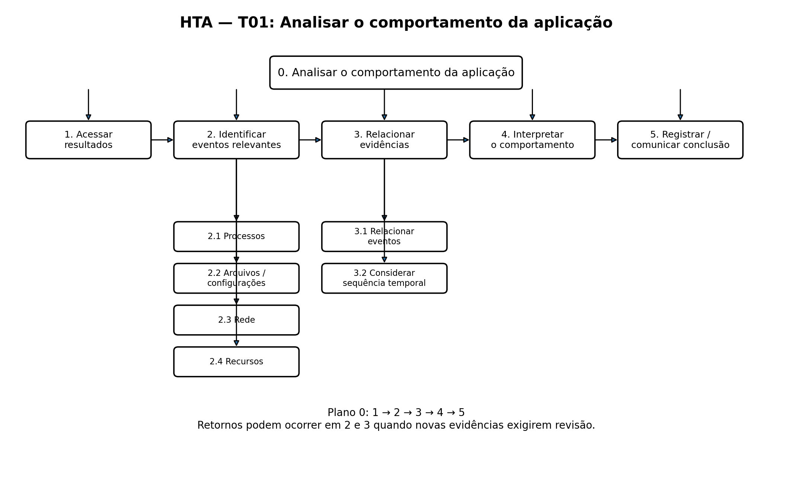
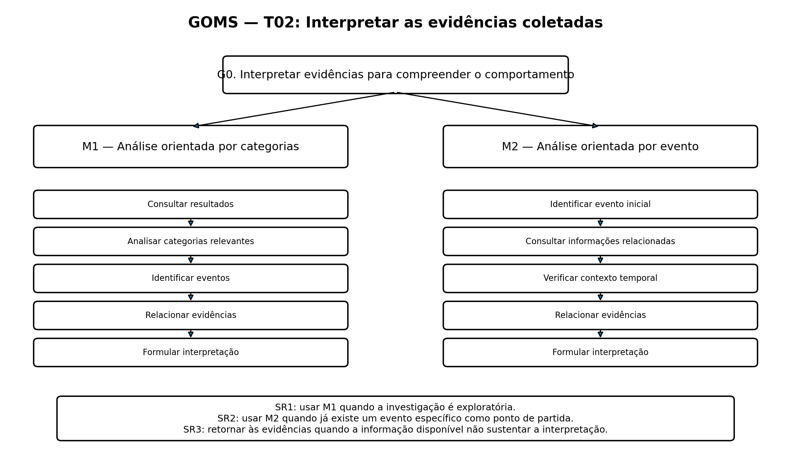
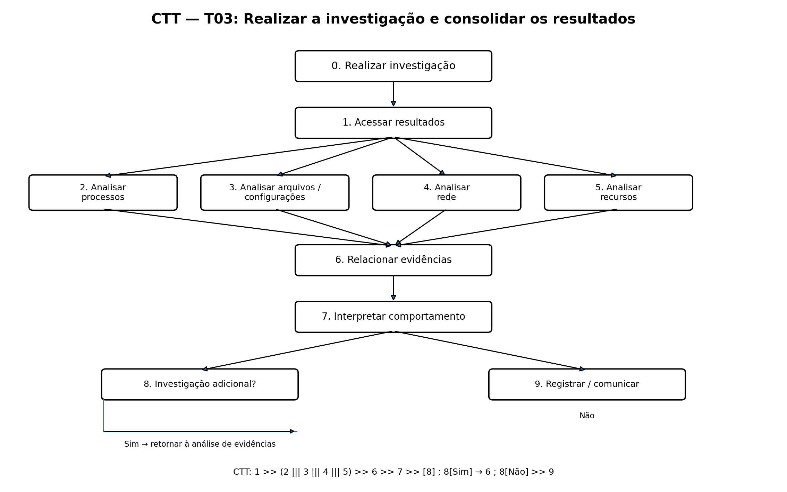

# Entrega 5 — Análise de tarefas: HTA, GOMS e CTT

**Data:** 05/10/2026  
**Status:** 🟩 concluída  
**Responsabilidade:** Cada integrante deve entregar pelo menos 1 HTA, 1 GOMS e 1 CTT relacionados às tarefas selecionadas.

## Objetivo

Analisar as tarefas relacionadas ao problema identificado nas entregas anteriores utilizando três técnicas de análise de tarefas:

- HTA — Hierarchical Task Analysis;
- GOMS — Goals, Operators, Methods and Selection Rules;
- CTT — ConcurTaskTrees.

A análise deve permitir compreender como o usuário realiza suas atividades atualmente, quais informações são necessárias, quais decisões são tomadas e onde existem dificuldades ou oportunidades de melhoria.

Como o TCC não possui uma interface formalmente definida, a análise permanece concentrada na atividade humana e no processo de investigação do comportamento de aplicações potencialmente não confiáveis. A interface será considerada apenas posteriormente, a partir das necessidades identificadas.

---

## 1. Seleção das tarefas

As tarefas foram selecionadas a partir do cenário C01 da Entrega 4 e das atividades identificadas anteriormente.

| ID | Tarefa | Relação com o problema | Técnica |
|---|---|---|---|
| T01 | Analisar o comportamento da aplicação após uma execução controlada | Permite compreender o que a aplicação realizou no sistema operacional | HTA |
| T02 | Interpretar as evidências coletadas durante a execução | Permite relacionar eventos e identificar comportamentos relevantes | GOMS |
| T03 | Realizar a investigação e consolidar os resultados | Envolve a análise de diferentes fontes de evidência e a consolidação das conclusões | CTT |

### Justificativa da seleção

As três tarefas representam etapas centrais da atividade de investigação identificada no cenário C01.

A tarefa T01 representa a análise geral do comportamento da aplicação após sua execução controlada.

A tarefa T02 representa a atividade cognitiva de interpretar os eventos e evidências coletados, identificando relações e possíveis significados.

A tarefa T03 representa o processo mais amplo de investigação, envolvendo diferentes categorias de evidências, relacionamento entre informações e consolidação dos resultados.

Essas tarefas foram escolhidas porque estão diretamente relacionadas ao objetivo da persona P01: compreender o comportamento de uma aplicação potencialmente não confiável a partir das evidências obtidas durante sua execução.

---

# 2. HTA — T01

## 2.1 Tarefa analisada

**T01 — Analisar o comportamento da aplicação após uma execução controlada**

### Objetivo

Compreender o comportamento da aplicação durante a execução controlada, identificando eventos relevantes e seus possíveis efeitos sobre o sistema operacional.

### Relação com a persona

**P01 — Rafael Mendes, Analista de Segurança da Informação**

### Necessidade relacionada

**R01 —** Entender o comportamento de uma aplicação potencialmente não confiável durante sua execução, utilizando as evidências coletadas no ambiente controlado para identificar ações e efeitos no sistema operacional.

---

## 2.2 Estrutura hierárquica

### 0. Analisar o comportamento da aplicação

**1. Acessar os resultados da execução**

**2. Identificar eventos relevantes**
- 2.1 Analisar processos
- 2.2 Analisar arquivos e configurações
- 2.3 Analisar comunicações de rede
- 2.4 Analisar utilização de recursos

**3. Relacionar as evidências**
- 3.1 Relacionar eventos entre diferentes categorias
- 3.2 Considerar a sequência temporal dos eventos

**4. Interpretar o comportamento observado**

**5. Registrar ou comunicar a conclusão**

### Plano

**0:** 1 → 2 → 3 → 4 → 5

Durante as etapas 2 e 3, o profissional pode retornar a uma categoria ou evidência anteriormente analisada caso encontre novas informações ou perceba que uma relação ainda não foi esclarecida.

---

## 2.3 Representação visual

---

## 2.4 Interpretação da HTA

A análise hierárquica demonstra que a investigação não é composta apenas pela observação de eventos isolados.

Primeiramente, o profissional precisa acessar os resultados produzidos pela execução controlada. Em seguida, identifica eventos relevantes em diferentes categorias, como processos, arquivos, configurações, rede e recursos.

Depois disso, as evidências precisam ser relacionadas, inclusive considerando a sequência temporal em que os eventos ocorreram. Somente após essa etapa é possível interpretar o comportamento observado e registrar ou comunicar uma conclusão.

A estrutura também evidencia que a investigação pode possuir retornos entre as etapas de identificação e relacionamento de evidências. Uma informação encontrada posteriormente pode exigir que o profissional retorne a uma categoria anteriormente analisada.

---

# 3. GOMS — T02

## 3.1 Tarefa analisada

**T02 — Interpretar as evidências coletadas durante a execução**

### Objetivo

Interpretar as evidências coletadas para compreender o comportamento da aplicação e determinar quais eventos são relevantes para a investigação.

### Relação com a persona

**P01 — Rafael Mendes, Analista de Segurança da Informação**

---

## 3.2 Goal

**G0 — Interpretar as evidências para compreender o comportamento da aplicação.**

O profissional precisa analisar as informações coletadas, identificar eventos relevantes, relacionar diferentes evidências e formular uma interpretação sobre o comportamento observado.

---

## 3.3 Método M1 — Análise orientada por categoria

**M1 — Analisar as evidências por categoria**

1. Consultar os resultados da execução.
2. Selecionar uma categoria de evidência.
3. Identificar eventos relevantes dentro da categoria.
4. Relacionar os eventos identificados com outras evidências.
5. Formular uma interpretação sobre o comportamento observado.

### Aplicação

Esse método pode ser utilizado quando o profissional está realizando uma investigação exploratória e deseja verificar sistematicamente as diferentes categorias de informações coletadas.

Por exemplo, o profissional pode analisar inicialmente processos, depois arquivos e configurações, posteriormente rede e, por fim, recursos utilizados.

---

## 3.4 Método M2 — Análise orientada por evento

**M2 — Investigar a partir de um evento específico**

1. Identificar um evento inicial considerado relevante.
2. Consultar informações relacionadas ao evento.
3. Verificar eventos anteriores e posteriores.
4. Relacionar as evidências encontradas.
5. Formular uma interpretação sobre o comportamento observado.

### Aplicação

Esse método pode ser utilizado quando o profissional encontra um evento específico que merece investigação mais aprofundada.

A partir desse evento, o profissional procura outras informações que possam explicar sua origem, consequência ou relação com outros acontecimentos.

---

## 3.5 Selection Rules

**SR1 —** Se a investigação ainda estiver em caráter exploratório, utilizar o método M1, analisando as informações por categoria.

**SR2 —** Se existir um evento específico considerado relevante ou suspeito, utilizar o método M2, investigando as evidências relacionadas a esse evento.

**SR3 —** Se as informações disponíveis forem insuficientes para formular uma interpretação, retornar à análise das evidências e buscar informações adicionais.

---

## 3.6 Representação visual

---

## 3.7 Interpretação do GOMS

A modelagem GOMS demonstra que a interpretação das evidências pode ocorrer por diferentes estratégias.

Na primeira estratégia, o profissional realiza uma análise sistemática das categorias disponíveis. Na segunda, parte de um evento específico e busca informações relacionadas para compreender seu contexto.

A existência dessas duas estratégias indica que a atividade de investigação não possui necessariamente um único caminho rígido. O profissional pode alternar entre uma análise mais exploratória e uma investigação direcionada conforme as informações encontradas.

Também é possível retornar às evidências quando os dados disponíveis não são suficientes para sustentar uma conclusão.

---

# 4. CTT — T03

## 4.1 Tarefa analisada

**T03 — Realizar a investigação e consolidar os resultados**

### Objetivo

Realizar uma investigação sobre o comportamento da aplicação utilizando diferentes categorias de evidências e, posteriormente, consolidar os resultados obtidos.

### Relação com a persona

**P01 — Rafael Mendes, Analista de Segurança da Informação**

### Relação com o cenário

A tarefa está diretamente relacionada ao cenário C01, no qual o profissional precisa investigar uma aplicação de comportamento desconhecido após sua execução em um ambiente controlado.

---

## 4.2 Estrutura CTT

### 0. Realizar investigação

**1. Acessar resultados**

Após acessar os resultados, o profissional pode analisar diferentes categorias de evidências.

**2. Analisar processos**

**3. Analisar arquivos e configurações**

**4. Analisar rede**

**5. Analisar recursos**

As atividades 2, 3, 4 e 5 podem ocorrer de maneira concorrente ou intercalada, dependendo da estratégia adotada pelo profissional.

**6. Relacionar evidências**

Após a análise das diferentes categorias, o profissional relaciona as informações encontradas.

**7. Interpretar comportamento**

Com base nas relações identificadas, o profissional interpreta o comportamento da aplicação.

**8. Verificar necessidade de investigação adicional**

- **Sim:** retornar à análise e ao relacionamento das evidências.
- **Não:** prosseguir para o registro ou comunicação da conclusão.

**9. Registrar ou comunicar conclusão**

---

## 4.3 Relações temporais

A estrutura geral da tarefa pode ser representada da seguinte maneira:

**1 → (2 ||| 3 ||| 4 ||| 5) → 6 → 7 → 8**

Quando a resposta para a etapa 8 for **Sim**:

**8 → 6**

Quando a resposta para a etapa 8 for **Não**:

**8 → 9**

A notação de concorrência representa que as diferentes categorias de evidências não precisam necessariamente ser analisadas em uma sequência fixa. O profissional pode alternar entre elas conforme as informações encontradas durante a investigação.

---

## 4.4 Representação visual

---

## 4.5 Interpretação do CTT

A representação CTT evidencia que a investigação envolve diferentes atividades que podem ocorrer de maneira concorrente ou intercalada.

O profissional não precisa necessariamente concluir toda a análise de processos antes de analisar arquivos, rede ou recursos. A descoberta de uma evidência pode direcionar a investigação para outra categoria.

Após analisar as informações disponíveis, é necessário relacionar as evidências e interpretar o comportamento observado.

Caso ainda existam dúvidas ou informações insuficientes, o profissional pode retornar às evidências e continuar a investigação. Quando considera que as informações são suficientes, pode consolidar e comunicar a conclusão.

---

# 5. Síntese da análise de tarefas

As três técnicas utilizadas apresentam perspectivas complementares sobre a atividade investigativa.

A **HTA** evidencia a decomposição da tarefa de análise do comportamento em etapas e subtarefas. Ela demonstra que a investigação envolve acesso aos resultados, identificação de eventos, relacionamento das evidências, interpretação e consolidação das conclusões.

O **GOMS** evidencia os objetivos e diferentes estratégias utilizadas pelo profissional para interpretar as informações. A análise pode ocorrer de forma exploratória, por categorias, ou de forma direcionada, partindo de um evento específico.

O **CTT** evidencia a relação temporal entre as atividades e mostra que diferentes categorias de evidências podem ser analisadas de forma concorrente ou intercalada.

Em conjunto, as análises indicam que o principal desafio da atividade não está apenas na coleta de eventos, mas principalmente na **interpretação e relacionamento das evidências**.

---

## 5.1 Principais dificuldades identificadas

A partir das análises realizadas, destacam-se as seguintes dificuldades:

- grande quantidade de eventos produzidos durante uma execução;
- necessidade de identificar quais eventos são realmente relevantes;
- necessidade de relacionar informações provenientes de diferentes categorias;
- necessidade de compreender a sequência temporal dos acontecimentos;
- dificuldade potencial de interpretar informações técnicas isoladas;
- possibilidade de retornar diversas vezes às evidências durante a investigação;
- necessidade de registrar e comunicar as conclusões obtidas.

---

## 5.2 Oportunidades identificadas para as próximas etapas

As oportunidades identificadas não representam ainda decisões de interface. Elas indicam necessidades que deverão ser investigadas nas próximas etapas do projeto.

Entre elas estão:

- apresentar uma visão geral dos resultados da investigação;
- permitir aprofundamento progressivo das informações;
- facilitar a localização de eventos relevantes;
- permitir relacionar evidências de diferentes categorias;
- fornecer contexto temporal para os eventos;
- permitir transição entre uma visão resumida e as evidências que sustentam determinada informação;
- apoiar investigações que necessitem retornar a evidências anteriores;
- facilitar o registro e a comunicação das conclusões.

---

# 6. Possíveis tarefas para avaliação futura

As tarefas abaixo poderão ser utilizadas posteriormente em avaliações ou testes de usabilidade:

1. Identificar os principais comportamentos apresentados por uma aplicação após sua execução controlada.
2. Localizar um evento relevante entre os resultados da análise.
3. Investigar quais outros eventos estão relacionados a um evento específico.
4. Identificar alterações realizadas pela aplicação em arquivos ou configurações.
5. Verificar possíveis comunicações realizadas pela aplicação.
6. Relacionar eventos ocorridos em momentos diferentes da execução.
7. Interpretar o conjunto de evidências e formular uma conclusão.
8. Localizar as evidências que sustentam uma determinada conclusão.

Essas tarefas deverão ser refinadas posteriormente, caso a interface seja definida como parte do escopo do projeto.

---

# 7. Legenda das técnicas

## HTA

**Hierarchical Task Analysis** — utilizada para decompor uma tarefa em objetivos, subtarefas e planos de execução.

## GOMS

**Goals, Operators, Methods and Selection Rules** — utilizada para representar objetivos, operações, métodos e regras de seleção utilizados pelo usuário.

## CTT

**ConcurTaskTrees** — utilizada para representar tarefas, relações temporais e possíveis atividades concorrentes ou intercaladas.

---

# 8. Checklist

- [x] Selecionamos tarefas coerentes com o problema identificado.
- [x] As tarefas possuem relação com a persona definida.
- [x] As tarefas possuem relação com o cenário C01.
- [x] Foi elaborado pelo menos um HTA.
- [x] Foi elaborado pelo menos um GOMS.
- [x] Foi elaborado pelo menos um CTT.
- [x] As técnicas foram aplicadas a tarefas relevantes para o TCC.
- [x] A análise permanece focada na atividade do usuário.
- [x] Não foram definidas telas ou componentes de interface como solução definitiva.
- [x] As dificuldades encontradas foram registradas.
- [x] Foram identificadas oportunidades para as próximas etapas.
- [x] As tarefas analisadas podem ser utilizadas posteriormente para avaliação da interação.
